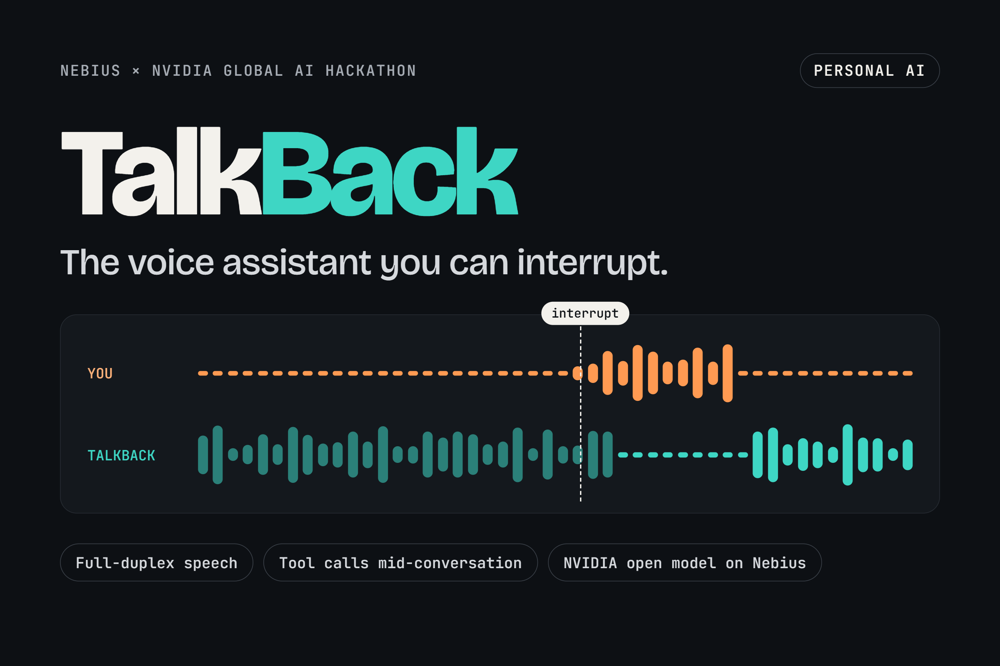
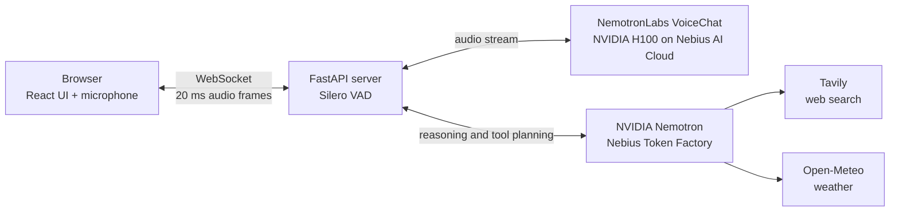

<div align="center">

# TalkBack

**The voice assistant you can interrupt.**

[](LICENSE)
[](https://www.python.org/)
[](https://fastapi.tiangolo.com/)
[](https://www.nvidia.com/)
[](https://nebius.com/)
[](#acknowledgements)

[Demo](#demo) · [How it works](#how-it-works) · [Quick start](#quick-start) · [Results](#results)

</div>

<p align="center">
  
</p>

> [!NOTE]
> TalkBack is in early development for the Nebius x NVIDIA Global AI Hackathon 2026 (Personal AI track).
> The backend gateway, the conversation screen, live browser audio, and the onboarding, memory, skills and settings screens are built. The voice model, audio streaming and tools are **planned**; see the [Roadmap](#roadmap).

## The problem

Most voice assistants work like walkie-talkies. You speak, then you wait, then they speak, and you cannot stop them. Real conversation is different: people interrupt, correct each other, and say "mm-hm" to show they are listening.

## What TalkBack does

- **Full-duplex audio.** TalkBack listens while it talks, so you never need to wait for it to finish.
- **Interruption recovery.** When you interrupt, it stops, remembers only the words you actually heard, and continues from your correction.
- **Backchannel awareness.** Short sounds like "mm-hm" or "yeah" mean "keep going", not "stop".
- **Tool calls without silence.** It can search the web or check the weather mid-conversation and speaks a short filler while it waits.

## Demo

Video coming soon.

<!-- TODO: add the YouTube link here, for example:
[](https://www.youtube.com/watch?v=VIDEO_ID)
-->

## How it works

The diagram shows the planned architecture.



When the user interrupts, TalkBack follows three steps:

1. **Detect real speech.** Silero VAD detects user speech. Speech shorter than 250 ms is ignored, so coughs and backchannels do not stop the assistant.
2. **Cut history at the playback position.** The browser reports the exact playback position of the assistant audio. The server keeps only the words that were actually played in the conversation history.
3. **Continue from the correction.** The model receives the trimmed history and the new user speech, and it answers from that point. If a tool call is needed, a short spoken filler covers the latency.

## Tech stack

The backend and frontend foundations are built. The model, tool and VAD layers are planned.

| Layer | Technology | Why |
| --- | --- | --- |
| Speech-to-speech | NVIDIA NemotronLabs VoiceChat | Full-duplex model: it can listen and speak at the same time. |
| GPU compute | NVIDIA H100 on Nebius AI Cloud | Enough memory and speed for real-time speech inference. |
| Reasoning and tools | NVIDIA Nemotron via Nebius Token Factory | Plans tool calls without hosting a second model ourselves. |
| Web search | Tavily | Search API designed for LLM agents. |
| Weather | Open-Meteo | Free weather API with no API key. |
| Backend | Python, FastAPI, WebSockets | Async server that streams audio in 20 ms frames. |
| Voice activity detection | Silero VAD | Small, fast, and accurate speech detector. |
| Frontend | React, TypeScript, Vite, Tailwind CSS | Shows both voices, the transcript and what was actually heard. |

## Results

No measurements exist yet. The values below are targets.

| Metric | Target | Measured |
| --- | --- | --- |
| Median response latency | < 500 ms | — |
| Interruption recovery rate (50 scripted conversations) | ≥ 90% | — |

Latency is measured as:

$$\text{latency} = t_{\text{first audio out}} - t_{\text{end of user speech}}$$

## Quick start

> [!NOTE]
> For spoken replies, add `NVIDIA_API_KEY` and `NEBIUS_API_KEY` (or `OPENROUTER_API_KEY`) to `backend/.env`. Without them the app still runs and explains what is missing. You can ask for the weather (Open-Meteo, no key needed). Interruption handling (barge-in) is not built yet.

### Prerequisites

- Git
- Python 3.11 or newer
- Node.js 20.19 or newer (for the frontend)

### Get the code

```bash
git clone https://github.com/ProttoyDip/talkback.git
cd talkback
```

### Run the backend

macOS / Linux:

```bash
cd backend
python3 -m venv .venv
.venv/bin/python -m pip install -r requirements.txt
cp .env.example .env
.venv/bin/python -m uvicorn app.main:app --port 8000 --ws-max-size 65536
```

Windows (PowerShell):

```powershell
cd backend
py -m venv .venv
.venv\Scripts\python -m pip install -r requirements.txt
copy .env.example .env
.venv\Scripts\python -m uvicorn app.main:app --port 8000 --ws-max-size 65536
```

Check that it runs. In a second terminal:

```bash
curl http://localhost:8000/health
```

The response is `{"status":"ok"}`.

### Run the tests

```bash
cd backend
.venv/bin/python -m pip install -r requirements-dev.txt
.venv/bin/python -m pytest
```

On Windows, use `.venv\Scripts\python` instead of `.venv/bin/python`.

### Run the frontend

```bash
cd frontend
npm install
npm run dev
```

Open http://localhost:5173 and press the mic button (or `Space`) to start a live session with the backend. Other modes:

- http://localhost:5173/?replay plays the recorded demo conversation, with no backend needed.
- `?state=interrupted`, `?state=tool`, `?state=confirm`, `?state=muted` or `?state=offline` shows a static preview of each state.

### Run the frontend tests

```bash
cd frontend
npm test        # unit tests (Vitest)
npm run e2e     # end-to-end tests (Playwright)
```

The end-to-end tests use the installed Microsoft Edge with a fake microphone, and start the backend and the dev server if they are not running. The backend virtual environment from "Run the backend" must exist.

## Configuration

The backend reads `backend/.env`. Copy it from [`backend/.env.example`](backend/.env.example). Never commit `backend/.env`.

| Variable | Description | Where to get it |
| --- | --- | --- |
| `SESSION_SECRET` | Signs the 15-minute session tokens. At least 32 characters. If empty, a random secret is used until the server restarts. | Generate one: `python -c "import secrets; print(secrets.token_urlsafe(48))"` |
| `ALLOWED_ORIGINS` | Comma-separated browser origins that may open the session WebSocket. | Your frontend URL. The default allows the Vite dev server. |
| `NEBIUS_API_KEY` | Key for NVIDIA Nemotron 3 Nano on Nebius Token Factory, which writes TalkBack's replies. | [Nebius Token Factory](https://tokenfactory.nebius.com/) |
| `TAVILY_API_KEY` | Key for Tavily web search. Not used yet. | [Tavily](https://tavily.com/) |
| `VOICECHAT_URL` | Private-network WebSocket URL of the VoiceChat container. Not used yet. | Your Nebius AI Cloud VM |
| `VOICE_ENGINE` | `cascade` (default: speech-to-text, Nemotron, text-to-speech) or `none` (accept audio, no replies). | Leave as `cascade` |
| `NVIDIA_API_KEY` | NVIDIA hosted speech models: Parakeet (speech-to-text) and Magpie TTS (text-to-speech). Required for spoken replies. | [build.nvidia.com](https://build.nvidia.com) (free credits) |
| `RIVA_SERVER`, `ASR_FUNCTION_ID`, `TTS_FUNCTION_ID`, `TTS_VOICE` | Where the speech models run and which voice speaks. Defaults are set; change only if NVIDIA updates its catalog. | NVIDIA model pages on build.nvidia.com |
| `OPENROUTER_API_KEY` | Backup provider for Nemotron, used if Nebius fails or has no key. Optional. | [OpenRouter](https://openrouter.ai) |

## Project structure

```text
talkback/
├── backend/
│   ├── app/
│   │   ├── main.py          # FastAPI app: /health, POST /api/session
│   │   ├── session.py       # WebSocket gateway: /ws/session
│   │   ├── protocol.py      # Validated message models
│   │   ├── tokens.py        # Signed, short-lived session tokens
│   │   ├── config.py        # Settings from .env
│   │   └── logs.py          # JSON logs, token redaction
│   ├── tests/               # pytest suite
│   ├── .env.example
│   ├── requirements.txt
│   └── requirements-dev.txt
├── frontend/
│   └── src/
│       ├── components/      # Timeline, transcript, mic button, ...
│       ├── screens/         # Conversation screen
│       ├── state/           # Types, status labels, example data
│       └── styles/          # tokens.css (design tokens), motion.ts
├── docs/
│   ├── prd.md               # Product requirements
│   ├── architecture.md      # System design
│   ├── design.md            # Design system and screens
│   └── images/
├── SECURITY.md              # Threat model and security rules
├── LICENSE
└── README.md
```

Planned: `eval/` (evaluation scripts) and `backend/skills/` (skill files).

## Evaluation

The planned `eval/` folder will contain scripts for two metrics:

- **Latency:** the median time from the end of user speech to the first audio output, using the formula in [Results](#results).
- **Interruption recovery:** the share of 50 scripted conversations where TalkBack stops, keeps only the words the user heard, and continues correctly from the user's correction.

## Roadmap

- [x] FastAPI backend: `/health`, session tokens, validated WebSocket gateway
- [ ] Audio streaming in 20 ms frames between the browser and the voice model
- [ ] NemotronLabs VoiceChat on an NVIDIA H100 on Nebius AI Cloud
- [ ] Interruption handling: Silero VAD, 250 ms minimum speech length, playback-position history trimming
- [ ] Nemotron tool planning via Nebius Token Factory, with Tavily and Open-Meteo tools
- [ ] Spoken filler during tool calls
- [x] Conversation screen (React): live transcript, duplex timeline, tool chips, confirmation card
- [x] Live audio in the frontend (microphone capture and playback)
- [x] First-run onboarding, Memory panel, Skills panel and Settings (microphone choice, tools, privacy, models); Skills and Settings need backend routes that are not built yet, so they show an error unless you add `?mock`
- [ ] Evaluation scripts for latency and interruption recovery
- [ ] Demo video
- [ ] More languages, including low-resource languages
- [ ] On-device version for NVIDIA Jetson
- [ ] Public benchmark for interruption handling

## Acknowledgements

- [NVIDIA](https://www.nvidia.com/) for the Nemotron models and the NemotronLabs VoiceChat model.
- [Nebius](https://nebius.com/) for Nebius AI Cloud and Token Factory, and for co-hosting the hackathon.
- [Tavily](https://tavily.com/) for the web search API.
- [Open-Meteo](https://open-meteo.com/) for the weather API.
- [Silero VAD](https://github.com/snakers4/silero-vad) for voice activity detection.

<!-- TODO: add author name and links (GitHub, LinkedIn, etc.) -->

## License

This project is licensed under the MIT License. See [LICENSE](LICENSE).
