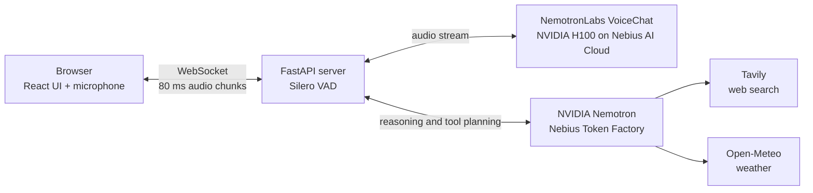

<div align="center">

# TalkBack

**The voice assistant you can interrupt.**

[](LICENSE)
[](https://www.python.org/)
[](https://fastapi.tiangolo.com/)
[](https://www.nvidia.com/)
[](https://nebius.com/)
[](#acknowledgements)

[Demo](#demo) · [How it works](#how-it-works) · [Quick start](#quick-start) · [Results](#results)

</div>

<p align="center">
  
</p>

> [!NOTE]
> TalkBack is in early development for the Nebius x NVIDIA Global AI Hackathon 2026 (Personal AI track).
> This README describes the planned design. Parts that are not built yet are marked as **planned** or listed in the [Roadmap](#roadmap).

## The problem

Most voice assistants work like walkie-talkies. You speak, then you wait, then they speak, and you cannot stop them. Real conversation is different: people interrupt, correct each other, and say "mm-hm" to show they are listening.

## What TalkBack does

- **Full-duplex audio.** TalkBack listens while it talks, so you never need to wait for it to finish.
- **Interruption recovery.** When you interrupt, it stops, remembers only the words you actually heard, and continues from your correction.
- **Backchannel awareness.** Short sounds like "mm-hm" or "yeah" mean "keep going", not "stop".
- **Tool calls without silence.** It can search the web or check the weather mid-conversation and speaks a short filler while it waits.

## Demo

Video coming soon.

<!-- TODO: add the YouTube link here, for example:
[](https://www.youtube.com/watch?v=VIDEO_ID)
-->

## How it works

The diagram shows the planned architecture.



When the user interrupts, TalkBack follows three steps:

1. **Detect real speech.** Silero VAD detects user speech. Speech shorter than 250 ms is ignored, so coughs and backchannels do not stop the assistant.
2. **Cut history at the playback position.** The browser reports the exact playback position of the assistant audio. The server keeps only the words that were actually played in the conversation history.
3. **Continue from the correction.** The model receives the trimmed history and the new user speech, and it answers from that point. If a tool call is needed, a short spoken filler covers the latency.

## Tech stack

All components below are planned.

| Layer | Technology | Why |
| --- | --- | --- |
| Speech-to-speech | NVIDIA NemotronLabs VoiceChat | Full-duplex model: it can listen and speak at the same time. |
| GPU compute | NVIDIA H100 on Nebius AI Cloud | Enough memory and speed for real-time speech inference. |
| Reasoning and tools | NVIDIA Nemotron via Nebius Token Factory | Plans tool calls without hosting a second model ourselves. |
| Web search | Tavily | Search API designed for LLM agents. |
| Weather | Open-Meteo | Free weather API with no API key. |
| Backend | Python, FastAPI, WebSockets | Async server that streams audio in 80 ms chunks. |
| Voice activity detection | Silero VAD | Small, fast, and accurate speech detector. |
| Frontend | React | Captures microphone audio and reports the playback position. |

## Results

No measurements exist yet. The values below are targets.

| Metric | Target | Measured |
| --- | --- | --- |
| Median response latency | < 500 ms | — |
| Interruption recovery rate (50 scripted conversations) | ≥ 90% | — |

Latency is measured as:

$$\text{latency} = t_{\text{first audio out}} - t_{\text{end of user speech}}$$

## Quick start

> [!IMPORTANT]
> The backend is not in the repository yet. You can clone the repository now. The setup steps below (virtual environment, `backend/requirements.txt`, `backend/.env.example`, and the `/health` check) will be added together with the backend code.

### Prerequisites

- Git
- Python 3.11 or newer (planned for the backend)
- API keys for the services listed in [Configuration](#configuration) (planned)

### Get the code

```bash
git clone https://github.com/ProttoyDip/talkback.git
cd talkback
```

## Configuration

Planned. The backend will read its settings from `backend/.env`, based on a `backend/.env.example` template. This section will list every variable, its purpose, and where to get it when that file is added.

## Project structure

Current repository contents:

```text
talkback/
├── docs/
│   └── images/        # README images (cover.png goes here)
├── LICENSE
└── README.md
```

Planned folders: `backend/` (FastAPI server), `frontend/` (React app), and `eval/` (evaluation scripts).

## Evaluation

The planned `eval/` folder will contain scripts for two metrics:

- **Latency:** the median time from the end of user speech to the first audio output, using the formula in [Results](#results).
- **Interruption recovery:** the share of 50 scripted conversations where TalkBack stops, keeps only the words the user heard, and continues correctly from the user's correction.

## Roadmap

- [ ] FastAPI backend with a WebSocket audio stream (80 ms chunks) and a `/health` endpoint
- [ ] NemotronLabs VoiceChat on an NVIDIA H100 on Nebius AI Cloud
- [ ] Interruption handling: Silero VAD, 250 ms minimum speech length, playback-position history trimming
- [ ] Nemotron tool planning via Nebius Token Factory, with Tavily and Open-Meteo tools
- [ ] Spoken filler during tool calls
- [ ] React frontend
- [ ] Evaluation scripts for latency and interruption recovery
- [ ] Demo video
- [ ] More languages, including low-resource languages
- [ ] On-device version for NVIDIA Jetson
- [ ] Public benchmark for interruption handling

## Acknowledgements

- [NVIDIA](https://www.nvidia.com/) for the Nemotron models and the NemotronLabs VoiceChat model.
- [Nebius](https://nebius.com/) for Nebius AI Cloud and Token Factory, and for co-hosting the hackathon.
- [Tavily](https://tavily.com/) for the web search API.
- [Open-Meteo](https://open-meteo.com/) for the weather API.
- [Silero VAD](https://github.com/snakers4/silero-vad) for voice activity detection.

<!-- TODO: add author name and links (GitHub, LinkedIn, etc.) -->

## License

This project is licensed under the MIT License. See [LICENSE](LICENSE).
