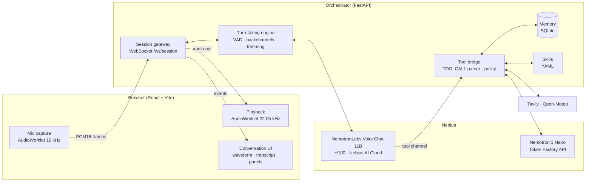
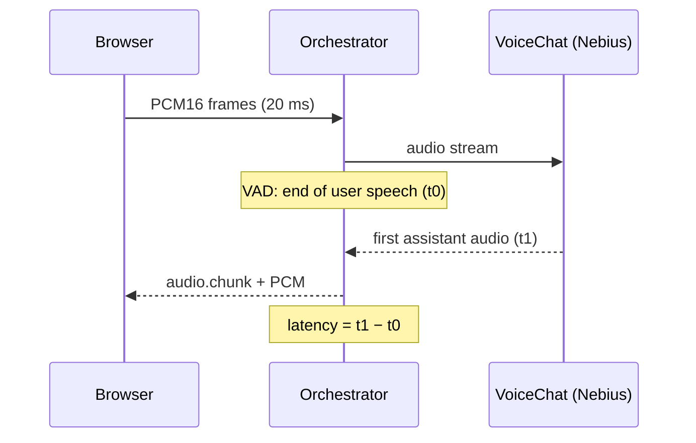
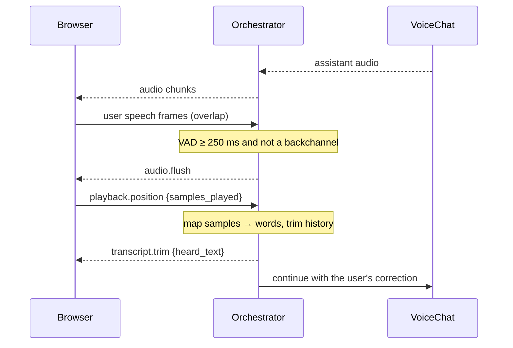
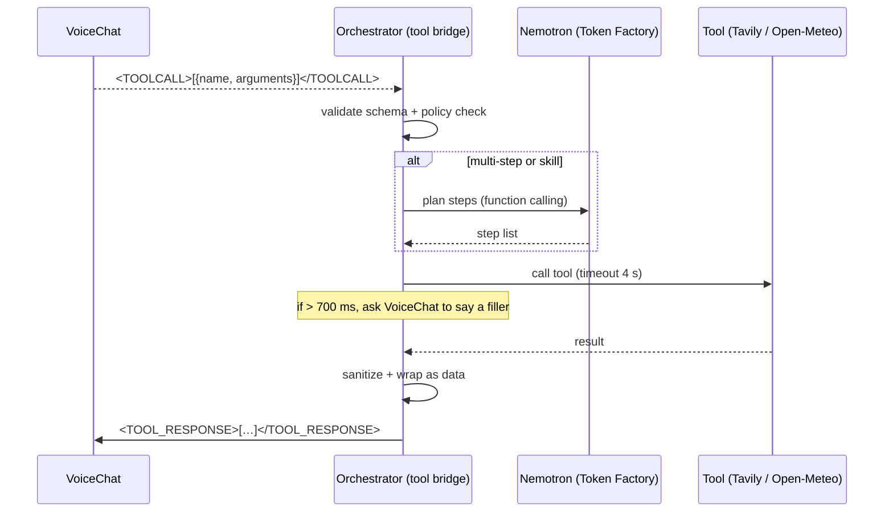
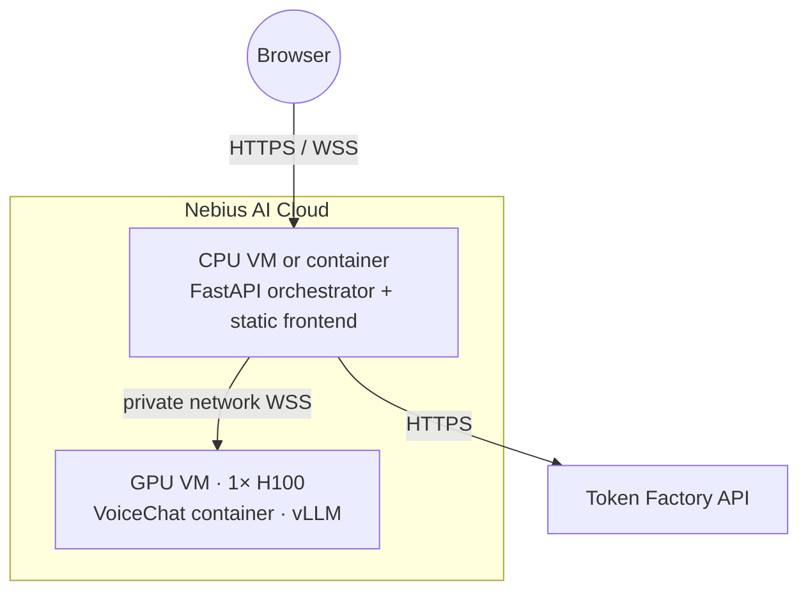

# TalkBack — Architecture

| | |
|---|---|
| **Status** | Draft v1 · 2 October 2026 |
| **Related docs** | [prd.md](prd.md) · [design.md](design.md) · [SECURITY.md](../SECURITY.md) |

This document describes how TalkBack is built. It is the source of truth for Claude Code and contributors. If code and this document disagree, update one of them in the same pull request.

---

## 1. System overview



**Why a backend in the middle?** The browser never talks to the voice model or any API directly. The orchestrator holds every API key, enforces tool policy, owns memory, and measures latency. This keeps secrets off the client and gives one place to apply security rules.

## 2. Components

### 2.1 Browser client (`frontend/`)
- **Stack:** React 19, TypeScript, Vite, Tailwind CSS, `motion` (the animation library, imported as `motion/react`).
- **Mic capture:** `getUserMedia` with `echoCancellation`, `noiseSuppression` and `autoGainControl` on. An `AudioWorklet` resamples to 16 kHz mono and sends 20 ms PCM16 frames (640 bytes) as binary WebSocket messages.
- **Playback:** an `AudioWorklet` ring buffer at 22.05 kHz. It reports the exact number of samples played, which drives transcript trimming. Playback is routed through a `MediaStreamAudioDestinationNode` into an `<audio>` element so the browser's echo canceller can see the far-end signal (validate in week 1; see ADR-4).
- **UI state machine:** `idle → listening → assistant_speaking → overlap → interrupted → thinking/tool → …` (see design.md, section 6).

### 2.2 Orchestrator (`backend/`)
- **Stack:** Python 3.11+, FastAPI, Uvicorn, `websockets`, `httpx`, Silero VAD, SQLite (with FTS5), Pydantic.
- **Session gateway:** one WebSocket per browser session. Authenticates with a short-lived session token (see SECURITY.md), relays audio, and emits UI events.
- **Turn-taking engine:** runs Silero VAD on incoming frames. While the assistant is speaking it decides: ignore (noise), backchannel (keep going), or interrupt (stop). On interrupt it tells the client to flush playback and trims history.
- **Tool bridge:** parses the voice model's tool channel (`<TOOLCALL>[…]</TOOLCALL>`), checks each call against policy, runs it, and returns `<TOOL_RESPONSE>[…]</TOOL_RESPONSE>`. Multi-step requests go to the Nemotron planner first.
- **Memory store:** SQLite table of memories with provenance. Only user utterances can create memories (see section 7).
- **Skills runner:** loads `skills/*.yaml`, matches trigger phrases, and runs steps with only the tools that skill allows.

### 2.3 Voice model: NVIDIA NemotronLabs VoiceChat 11B
- Unified full-duplex speech-to-speech model: Fast Conformer speech encoder, Nemotron Nano v2 LLM backbone (hybrid Mamba-Transformer), NVIDIA TTS decoder, plus a separate output channel for tool calls.
- Input 16 kHz audio, output 22.05 kHz audio. Reported turn-taking latency of about 450 ms.
- Runs on A100, H100, H200, B100, B200 or RTX 6000 class GPUs with vLLM, on Linux.
- Serving: NVIDIA's optimized container with a bidirectional WebSocket interface (see the realtime instructions in NVIDIA's Speech repository).
- **English only.** License: OpenMDW v1.1.

### 2.4 Planner: NVIDIA Nemotron 3 Nano on Nebius Token Factory
- Model ID: `nvidia/nvidia-nemotron-3-nano-30b-a3b` (262K context, function calling and structured output).
- OpenAI-compatible API. Base URL `https://api.tokenfactory.nebius.com/v1/`, key in `NEBIUS_API_KEY`.
- Used for: multi-step skill planning, summarizing web results into short spoken answers, and memory extraction ("is this utterance a preference worth remembering?").

### 2.5 External tools
| Tool | Purpose | Auth |
|---|---|---|
| Tavily | Web search | `TAVILY_API_KEY` (server only) |
| Open-Meteo | Weather forecast | None (free, no key) |

## 3. Session protocol (browser ↔ orchestrator)

The contract lives in code in `backend/app/protocol.py`. This section and that file change together, in a separate "contract" pull request (see [plan.md](plan.md), section 4). The shared test fixture is [`fixtures/demo_session.jsonl`](fixtures/demo_session.jsonl).

### 3.1 WebSocket

One WebSocket: `wss://<host>/ws/session?token=<session-token>`. The token comes from `POST /api/session` and expires after 15 minutes.

- **Binary messages:** audio. Client → server: PCM16 mono 16 kHz, 20 ms frames (640 bytes). Server → client: PCM16 mono 22.05 kHz chunks, each preceded by an `audio.chunk` JSON header with its `seq` and sample count.
- **Text messages:** JSON events with a `type` field. Unknown types and unknown fields are rejected. Optional fields may be left out; a missing optional field means `null`.

| Direction | `type` | Payload | Purpose |
|---|---|---|---|
| C → S | `session.start` | `{client_sample_rate: 16000}` | Open a conversation (must be first) |
| C → S | `playback.position` | `{seq, samples_played}` | Sent every 100 ms and on stop |
| C → S | `control.mute` | `{muted}` | User mute toggle |
| C → S | `tool.confirm` | `{call_id, approved}` | Answer to a confirmation request |
| S → C | `state` | `{state, tool?}` | Drives the UI state machine; `tool` is set with state `tool` |
| S → C | `audio.chunk` | `{seq, samples}` | Header before each audio binary message |
| S → C | `audio.flush` | `{reason}` | Stop playback now (`interrupted` or `stopped`) |
| S → C | `transcript.delta` | `{message_id, speaker, text, final, backchannel}` | Live captions. Deltas with the same `message_id` form one turn: user deltas carry the full text so far, assistant deltas append words as they start playing. `backchannel: true` marks a "mm-hm" that did not interrupt |
| S → C | `transcript.trim` | `{message_id, heard_text, unheard_text}` | After an interruption, the message keeps `heard_text` in history. `unheard_text` (what it had planned to say) is only shown, faded |
| S → C | `tool.status` | `{call_id, message_id, name, status, sources}` | Tool chip under assistant turn `message_id`; `sources` lists web results |
| S → C | `tool.confirm_request` | `{call_id, summary, expires_in_ms}` | Ask the user before a sensitive action (30 s) |
| S → C | `memory.saved` | `{id, text}` | Show "remembered" toast |
| S → C | `metrics` | `{latency_ms}` | Live latency readout (debug mode) |
| S → C | `error` | `{code, message, retry_in_ms?}` | A problem to show the user (`voice_engine_offline`, `tool_failed`, `rate_limited`, `internal`). The session stays open |
| S → C | `model.active` | `{role, provider, model, backup}` | Which model serves `voice`, `planner` or `search`. Sent at session start and on every switch; `backup: true` shows the "Backup model" label (plan.md section 8) |
| S → C | `session.end` | `{reason}` | Sent just before the server closes (`idle`, `time_limit`, `server_shutdown`, `protocol_error`) |

Tool names: `weather`, `web_search`, `memory_read`, `memory_write`, `memory_delete`, `skill_run`.

### 3.2 REST API

All routes except `/health` and `POST /api/session` need `Authorization: Bearer <session-token>`. Bodies are JSON and validated with the models in `protocol.py`.

| Method and path | Request | Response | Used by |
|---|---|---|---|
| `GET /health` | — | `{status: "ok"}` | Monitoring |
| `POST /api/session` | — | `{token, expires_at}` | Session start |
| `GET /api/memories?q=` | optional search text | `MemoryList` | Memory panel |
| `PATCH /api/memories/{id}` | `MemoryUpdate` | `MemoryItem` | Edit a memory |
| `DELETE /api/memories/{id}` | — | `204` | Delete a memory |
| `DELETE /api/memories` | — | `204` | "Forget everything" |
| `GET /api/skills` | — | `SkillList` | Skills panel |
| `POST /api/skills/{id}/run` | — | `SkillRunAccepted` (`202`) | "Run" button; progress arrives on the WebSocket |
| `GET /api/settings` | — | `SettingsView` | Settings, including `models`: the fixed voice model, the planner allowlist and the providers in backup order |
| `PATCH /api/settings` | `SettingsUpdate` | `SettingsView` | Tool toggles, privacy switches, planner model, backups on or off |

Provider IDs: `nebius`, `openrouter`, `agentrouter`, `nararouter`, `experimentallab`, `tavily`, `perplexity`. The browser only ever sees provider IDs, display names and model names; never keys or URLs.

## 4. Key flows

### 4.1 Normal turn



### 4.2 Interruption



**Mapping samples to words.** The orchestrator keeps word-level timestamps for each assistant message (from the model's text channel aligned with audio chunk boundaries). `samples_played / 22050` gives the playback time; every word ending before that time is "heard". Unheard words are removed from the history sent back to the model and shown faded in the UI.

**Backchannel rule.** If the overlapping speech is shorter than 600 ms and its streaming transcript matches the backchannel list (`mm-hm`, `uh-huh`, `yeah`, `okay`, `right`, `sure`), the assistant keeps talking. Tune the list and thresholds with the eval set.

### 4.3 Tool call



## 5. Latency budget

Target: median under 500 ms from end of user speech to first assistant audio.

| Stage | Budget |
|---|---|
| Mic capture + 20 ms framing | 30 ms |
| Browser → orchestrator network | 40 ms |
| VAD end-of-speech decision | 100 ms |
| Orchestrator → VoiceChat (same Nebius region) | 10 ms |
| VoiceChat time to first audio | 250 ms |
| Orchestrator → browser + playback start | 60 ms |
| **Total** | **≈ 490 ms** |

Rules that protect the budget:
- Run the orchestrator and the voice model in the same Nebius region.
- Never buffer full sentences; forward audio chunks as they arrive.
- Keep tool calls off the audio path: tools run concurrently while the model keeps the floor.
- Log `t0` and `t1` for every turn so regressions show up immediately.

## 6. Deployment



- **Voice model:** one H100 VM on Nebius AI Cloud running NVIDIA's VoiceChat container. Exposed only on the private network to the orchestrator, never to the internet.
- **Orchestrator and frontend:** a small CPU VM (or the same GPU VM during development) serving FastAPI and the built React app behind HTTPS.
- **Secrets:** environment variables on the server, loaded from `.env`, never committed.
- **Cost control:** stop the GPU VM when not testing or recording.

## 7. Memory and skills

### 7.1 Memory schema (SQLite)

```sql
CREATE TABLE memories (
  id          TEXT PRIMARY KEY,
  text        TEXT NOT NULL,          -- "Prefers short answers"
  kind        TEXT NOT NULL,          -- preference | fact | reminder
  source      TEXT NOT NULL,          -- always 'user_utterance'
  utterance   TEXT NOT NULL,          -- the exact words that created it
  created_at  TEXT NOT NULL,
  confidence  REAL NOT NULL
);
CREATE VIRTUAL TABLE memories_fts USING fts5(text, content='memories');
```

- A memory is created only from the user's own transcribed words, after Nemotron classifies the utterance as a preference or fact.
- Tool outputs and web content can never write memory (defense against memory poisoning; see SECURITY.md).
- Relevant memories are retrieved with FTS5 and added to the session context, wrapped as data.

### 7.2 Skill format

```yaml
# skills/morning_brief.yaml
name: Morning brief
triggers: ["morning brief", "start my day"]
allowed_tools: [weather, web_search, memory_read]
steps:
  - tool: memory_read
    query: "home city"
  - tool: weather
    args_from: previous
  - tool: web_search
    query: "top news today"
    max_results: 3
  - speak: "Summarize weather and three headlines in under 30 seconds."
```

A skill can only use the tools in its `allowed_tools` list. The runner rejects anything else.

## 8. Repository layout

```
talkback/
├── backend/
│   ├── app/
│   │   ├── main.py            # FastAPI app, routes
│   │   ├── session.py         # WebSocket gateway
│   │   ├── protocol.py        # Pydantic message models
│   │   ├── turn_taking.py     # VAD, backchannels, trimming
│   │   ├── voice_client.py    # VoiceChat WebSocket client
│   │   ├── tool_bridge.py     # TOOLCALL parsing, policy, execution
│   │   ├── planner.py         # Nemotron via Token Factory
│   │   ├── tools/             # tavily.py, weather.py, memory.py
│   │   ├── memory.py          # SQLite store
│   │   └── skills.py          # YAML loader and runner
│   ├── skills/                # *.yaml
│   ├── tests/
│   └── requirements.txt
├── frontend/
│   └── src/
│       ├── audio/             # capture.worklet.ts, playback.worklet.ts
│       ├── components/
│       ├── state/             # session state machine
│       └── styles/tokens.css
├── eval/                      # latency.py, interruptions.py, scripts/
├── docs/                      # prd.md, architecture.md, design.md, images/
├── SECURITY.md
└── README.md
```

## 9. Architecture decisions

| ID | Decision | Alternatives | Reason |
|---|---|---|---|
| ADR-1 | Use the native full-duplex model (VoiceChat) | Cascade: streaming ASR → LLM → TTS | Lower latency and natural overlap handling; built-in tool channel. Cascade kept as fallback. |
| ADR-2 | Dedicated GPU VM for the voice model | Nebius Serverless endpoint | Long-lived WebSocket sessions and predictable latency. Serverless is an option for later. |
| ADR-3 | Orchestrator between browser and model | Browser connects directly to the model | Keeps keys and tool policy server-side; one place for metrics and security. |
| ADR-4 | WebSocket + AudioWorklet | WebRTC | Simpler for a single-server hackathon build. Echo cancellation must be handled explicitly; revisit WebRTC if echo is unmanageable. |
| ADR-5 | Local SQLite memory | Vector database | Small data, simple deployment, easy to inspect and delete; FTS5 is enough. |
| ADR-6 | Nemotron 3 Nano on Token Factory as planner | Use VoiceChat alone | Better multi-step planning and summarization without loading the speech model. |

## 10. Failure modes

| Failure | Detection | Behavior |
|---|---|---|
| Voice model unreachable | WebSocket connect fails | UI shows "Voice engine offline"; retry with backoff |
| Network drop | Client heartbeat timeout (5 s) | Auto-reconnect; keep transcript |
| Tool timeout (> 4 s) | Timer | Model says it could not get the result |
| Token Factory error | HTTP 4xx/5xx | Fall back to VoiceChat alone, no planning |
| Echo-triggered false interruptions | Spike in interrupts with no user transcript | Raise VAD threshold while the assistant speaks; suggest headphones |

## 11. Observability

- Structured JSON logs with a `session_id` and `turn_id` (no audio, no API keys, transcripts only in debug mode).
- Per-turn metrics: `t_end_of_speech`, `t_first_audio`, `interrupted`, `backchannel`, `tool_calls`, `tool_latency_ms`.
- A debug overlay in the UI (toggle with `?debug=1`) shows live latency.

## 12. Testing

| Layer | What | How |
|---|---|---|
| Unit | Protocol models, TOOLCALL parser, trimming math, policy | `pytest` |
| Integration | Gateway with a fake voice model that replays recorded output | `pytest` + WebSocket test client |
| Evaluation | Latency and interruption accuracy on 50 scripted conversations | `eval/` scripts with pre-recorded user audio |
| Manual | Demo script end to end in Chrome | Checklist before recording |

## References

- NVIDIA NemotronLabs VoiceChat 11B model card: https://huggingface.co/nvidia/NVIDIA-NemotronLabs-VoiceChat-11B
- NemotronLabs VoiceChat paper: https://arxiv.org/html/2609.21967
- Nebius Token Factory: https://docs.tokenfactory.nebius.com/switch
- Nemotron 3 Nano on Token Factory: https://github.com/nebius/token-factory-cookbook/blob/main/models/nemotron/nemotron3-nano-30b.md
- Nebius Serverless AI endpoints: https://docs.nebius.com/serverless/endpoints/manage
- Echo cancellation in browser voice agents: https://dev.to/remi_etien/i-built-a-voice-ai-with-sub-500ms-latency-heres-the-echo-cancellation-problem-nobody-talks-about-14la
